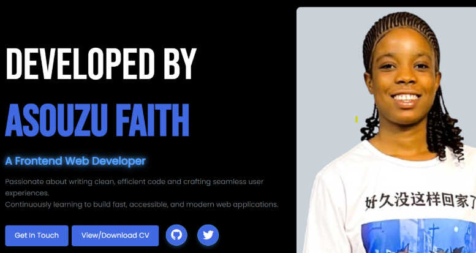

# 💻 Asouzu Faith - Portfolio Website

Welcome to my personal portfolio! This project showcases my frontend development journey, skills, and selected projects. It's designed to reflect my passion for clean design, responsive layouts, and continuous learning.

## 🌐 Live Site

🔗 [View Portfolio](https://asouzuchidimma.github.io/my-personal-portfolio/)

## 📸 Preview

## 🛠️ Technologies Used

- HTML5
- CSS3
- Bootstrap
- JavaScript
- EmailJS (for contact form functionality)

## 📄 Pages

- `index.html` – Home
- `about.html` – About Me
- `projects.html` – Projects
- `skills.html` – Skills
- `contact.html` – Contact
- `main.html` – Portfolio Overview

## ✨ Features

- Smooth scrolling and fade-in animations
- Fully responsive layout
- Project previews with live working links
- Functional contact form powered by EmailJS

## 📬 Contact

Feel free to reach out via the [Contact Page](https://asouzuchidimma.github.io/my-personal-portfolio/contact.html)  
Or connect with me on [GitHub](https://github.com/asouzuchidimma)
