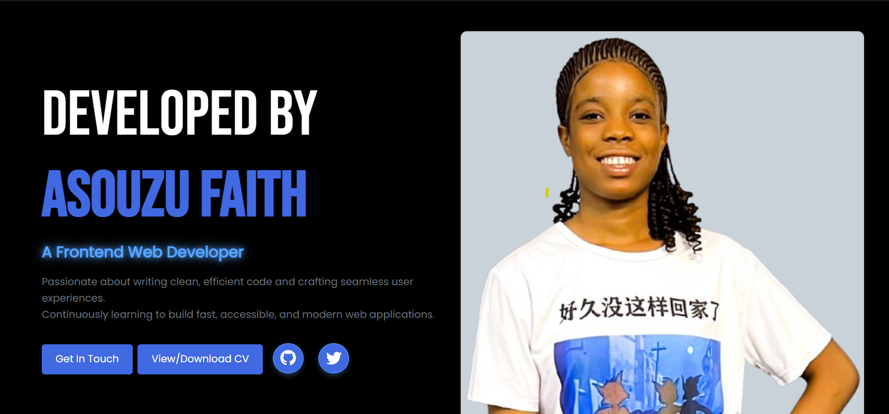

#  Asouzu Faith - Portfolio Website

Welcome to my personal portfolio! This project showcases my frontend development journey, skills, and selected projects. It's built to demonstrate my passion for clean design, responsive layouts, and continuous learning.

## Live Site
🔗 [View Portfolio](https://asouzuchidimma.github.io/my-personal-portfolio/)

##  Preview
 

##  Technologies Used
- HTML5  
- CSS3  
- Bootstrap  
- JavaScript  
- EmailJS (for contact form functionality)

##  Pages
- `index.html` – Home  
- `about.html` – About Me  
- `projects.html` – My Projects  
- `skills.html` – Skills  
- `contact.html` – Contact Form
- `main.html` – porfolio

##  Contact
Feel free to reach out via the [Contact Page](https://asouzuchidimma.github.io/my-personal-portfolio/contact.html)  
Or connect on [GitHub](https://asouzuchidimma.github.io/my-personal-portfolio/)

---

